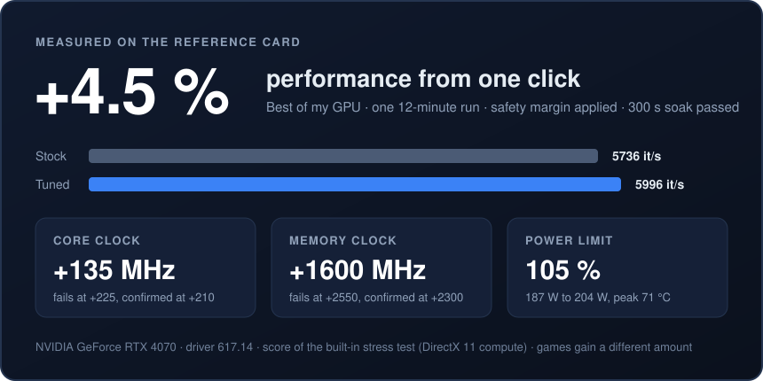
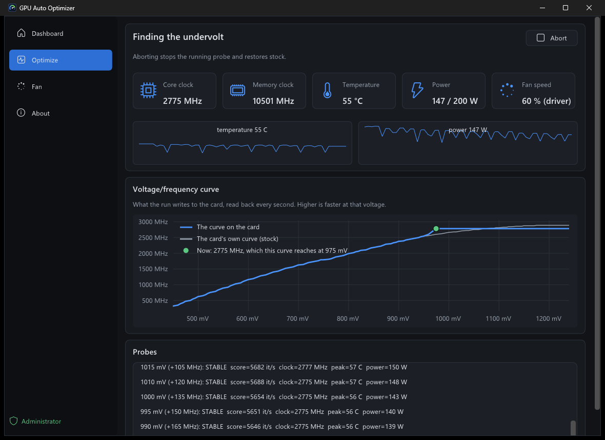
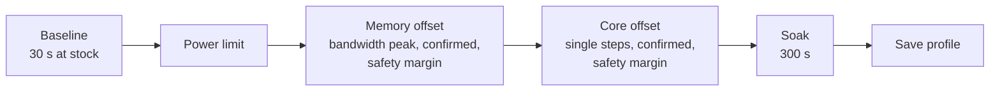

<div align="center">


# GPU Auto Optimizer

**Finds the fastest settings your NVIDIA graphics card is stable at, and keeps them applied.**

[](https://github.com/Rovey/gpu-auto-optimizer/releases/latest)
[](https://github.com/Rovey/gpu-auto-optimizer/actions/workflows/ci.yml)
[](LICENSE)


[**Download**](https://github.com/Rovey/gpu-auto-optimizer/releases/latest) · [How it works](#how-it-works) · [Command line](#command-line) · [FAQ](#faq)


</div>

## What it does

GPU Auto Optimizer tunes the **power limit** and the **core and memory clock offsets** of an NVIDIA card. It stress-tests every candidate setting and keeps the highest one that computes correct results, then backs off by a safety margin. You pick a goal and press one button; a run takes about a quarter of an hour. It can also **undervolt**: keep the speed the card has at stock and find the lowest voltage that holds it.

- **Four clock profiles and an undervolt:** Best of my GPU, Cool & efficient, Quiet and Max performance, or the same speed on less voltage.
- **You see what it does:** during a run the window draws the card's voltage/frequency curve as the run writes it, over the card's own.
- **Verified, not trusted:** every value written to the driver is read back and checked, and a failed apply ends at stock.
- **Crash-proof search:** a journal on disk records each candidate before it is tried, so a setting that froze the machine is never tried again.
- **Stays applied:** the tray app re-applies the tune at every logon, and within about half a minute after a driver reset (TDR).
- **Fan curves:** Silent, Normal, Cool or Aggressive with any profile, or your own; fans stop at idle without cycling on and off, the app learns the lowest speed your fans can actually hold, and the fans go back to the driver on exit, sleep, logoff and crashes.
- **Plays fair:** if MSI Afterburner or another tool changes the settings, it steps aside instead of fighting over them.
- **Updates itself:** a quiet line at the bottom left says when a new version is out; one click downloads it, checks it and restarts the app. Nothing pops up, and nothing is installed without that click.
- **Native and small:** two C++ programs, under 2 MB together, with no installer, no runtime and no driver or service.

## One click, +4.5 % performance, with a safety margin

<div align="center">



</div>

One run of **Best of my GPU** on the reference card, an RTX 4070, with nothing else to set:

| | Stock | After one click |
|---|---|---|
| Stress-test score | 5736 it/s | **5996 it/s (+4.5 %)** |
| Core clock under load | 2766 MHz | 2899 MHz (offset +135 MHz) |
| Memory clock under load | 10355 MHz | 12100 MHz (offset +1600 MHz) |
| Power under load | 187 W | 204 W (power limit 105 %) |

The search raised each clock until the card computed a wrong value (core +225 MHz, memory +2550 MHz), confirmed the last values that held (+210 and +2300 MHz) and applied them minus a safety margin. The result then had to pass a five-minute soak before it was saved. The whole run took 11.7 minutes.

> [!NOTE]
> The score is the app's own stress test, a DirectX 11 compute load. Games gain a different amount, and every card has its own limits. The log of this run is in [docs/hardware-checks.md](docs/hardware-checks.md) (check 52, fourth run).

## Quick start

1. Download `GpuAutoOptimizer-<version>-win-x64.zip` from the [latest release](https://github.com/Rovey/gpu-auto-optimizer/releases/latest) and unzip it anywhere.
2. Start **`GpuAutoOptimizer.exe`**.
3. Open **Optimize**, pick a profile and press **Optimize GPU**. The app asks for administrator rights, because it changes clocks and power limits.
4. When the run is done, turn on **Apply at logon** to keep the result after a restart.

> [!NOTE]
> The executables are not code-signed yet, so Windows SmartScreen may warn on the first start. Choose **More info**, then **Run anyway**. To check the download first:
> ```powershell
> (Get-FileHash .\GpuAutoOptimizer-<version>-win-x64.zip -Algorithm SHA256).Hash   # compare with the .sha256 file
> gh attestation verify .\GpuAutoOptimizer-<version>-win-x64.zip --repo Rovey/gpu-auto-optimizer
> ```

Turning on **Apply at logon** copies the app to `%ProgramFiles%\GpuAutoOptimizer\`, so the unzipped folder can be deleted afterwards.

## Requirements

| | |
|---|---|
| OS | Windows 10 (version 1803 or later) or 11, 64-bit |
| GPU | NVIDIA, Pascal (GTX 10-series) or newer, with a current driver |
| Rights | Administrator to optimize or apply; reading telemetry does not need them |

## Profiles

| Profile | Goal | Temperature limit | Tunes |
|---|---|---|---|
| **Best of my GPU** (default) | Highest confirmed clocks with a safety margin, most power the card allows | 75 °C | power, core, memory |
| **Cool & efficient** | Lowest power limit that costs under 2 % speed; clocks stay stock | 65 °C | power |
| **Quiet** | Milder clocks and the lowest power limit that costs under 2 % speed | 80 °C | power, core, memory |
| **Max performance** | Highest confirmed clocks minus one step, highest power limit | 83 °C | power, core, memory |
| **Undervolt** | The clock the card runs under load at stock, on the lowest stable voltage plus the same margin; clocks and power limit stay stock | 75 °C | the voltage/frequency curve |

The safety margin: the search finds the highest stable offset and applies a fraction of it (70 % for Best of my GPU), always at least one step below the edge.

The undervolt is saved in place of an overclock, not next to it: on the card a core offset and the curve are one table. On the reference RTX 4070 four runs kept the stock clock within about 2 % of the stress-test score and saved 25 %, 22 %, 20 % and 12 % of the power (188 to 141 W at best). The saving depends on the temperature the card settles at: its built-in curve moves under the offsets that were written, and above about 57 °C the same clock cost about 15 W more.

<div align="center">

</div>

## How it works



- **Stress test.** A DirectX 11 compute load in which the GPU checks every value it computes against a known answer. Each probe ends in a verdict: `STABLE`, `WRONG RESULT`, `DEVICE LOST`, `STALLED` (the values were right but the card computed almost nothing), `TOO HOT` or `NO TELEMETRY`.
- **Memory comes first and stops at the bandwidth peak,** not at the first error. GDDR6 and GDDR6X retry failed transfers, so an overclocked memory bus loses speed long before it returns a wrong result. The search raises the offset 50 MHz at a time, measures bandwidth at each step and keeps the lowest offset within 1 % of the best. Where bandwidth cannot be measured, it climbs until a probe fails instead.
- **The core search climbs from stock.** With the chosen memory offset applied, it raises the core offset 15 MHz at a time until a probe fails, and keeps the last value that passed. How far it may go comes from the range the driver reports for your card, so a card that can hold more is not stopped at a fixed limit.
- **Each edge is confirmed.** The value a search ends on gets a 30 s probe, and a lower value is tried if it does not hold. The safety margin is applied to the confirmed value, and the result as a whole must pass the 300 s soak.
- **A driver reset ends that clock's search.** On a card the search can push past its edge, a search resets the driver: the screen goes black for a moment. The run then reconnects to the driver, sets the card to stock, leaves it without load for 20 seconds and checks with a short probe at stock that it computes normally again. After that the search tries no new values for that clock: it keeps the last value that passed and confirms four steps below it. Each clock has its own search, so a reset in the memory search does not keep the core from being searched; a run can therefore reset the driver twice, once per clock. One reset more than that ends the run at stock with nothing saved, and so does a card that does not come back. Results on real cards are in [docs/hardware-checks.md](docs/hardware-checks.md), checks 51 and 52.
- **The undervolt search descends.** It measures the clock the card runs under load at stock and where on its voltage/frequency curve that clock sits. Then it raises a point one step lower on the curve to that clock and caps every point above it, so the card has no reason to ask for more voltage, and tests that; then the next point down, until one fails. The lowest point that passed gets the 30 s probe, the margin is applied to how far that point was raised, and the result must pass the 300 s soak. No voltage is locked and the points below stay as they are, so idle clocks do not change.
- **Crash journal.** Before a candidate touches the hardware, a `begin` line is flushed to disk. If the machine freezes, the unmatched `begin` becomes a ceiling the next run stays below.
- **Apply at logon.** A scheduled task starts the app in the tray at logon, which applies the saved profile. It refuses when the driver version or the card changed since tuning, and it stops after three logons in a row that crashed within two minutes.
- **Tune watchdog.** Every 30 seconds the tray app reads back what the driver reports. It re-applies after a reset, and backs off when another program changed the settings. Four resets within an hour, of the tune or of the driver with the tune applied, are a sign it is not stable: the card is set to stock and the tune is no longer re-applied.

## Command line

`gao.exe` ships next to the app and drives the same engine. Commands that write to the GPU need an elevated shell.

| Command | What it does |
|---|---|
| `gao --optimize best\|quiet\|cool\|max [--fan-curve silent\|normal\|cool\|aggressive]` | Runs the search; exit code 0 when saved, 2 when applied but not saved |
| `gao --undervolt` | Runs the undervolt search; saved like `--optimize`, in place of a saved overclock |
| `gao --apply` | Re-applies the saved profile |
| `gao --reset` | Returns to stock clocks and the default power limit |
| `gao --boot on\|off` | Turns apply-at-logon on or off |
| `gao --fan auto` | Hands every fan back to the NVIDIA driver, whatever set it (a running tray app takes them again on its next tick; switch Fan control off to keep the driver in charge) |
| `gao --status` | Saved profile, what is applied now, apply-at-logon state |
| `gao --probe` | Live telemetry: clocks, temperature, fan, power, clock-offset ranges |
| `gao --curve` | Prints the voltage/frequency curve as the driver reports it; changes nothing |
| `gao --stress <seconds>` | Runs the stress test alone and prints its verdict; changes nothing |
| `gao --bandwidth` | Measures the current memory bandwidth |
| `gao --update` | Installs the latest release into the folder `gao.exe` is in, if there is a newer one |
| `gao --stress-recreate` | Runs the stress test, rebuilds its GPU device, runs it again; prints both scores and the rebuild time; changes nothing |

Ctrl+C during `--optimize` restores stock.

## FAQ

<details>
<summary><b>Does it connect to the internet?</b></summary>

Only to look for a new version: one request to `api.github.com` when the app starts and once a day after that. Nothing but the request itself is sent. You can switch it off under **About**. An update is downloaded only when you click **Update available** (or run `gao --update`): the zip comes from this project's GitHub releases over HTTPS and is installed only when its SHA-256 matches the one GitHub publishes for it.
</details>

<details>
<summary><b>How do I move to a new version?</b></summary>

From 0.3.1 on, click **Update available** at the bottom left of the window. From an older version, download the zip and start `GpuAutoOptimizer.exe` from it: it offers to replace the older copy that runs in the tray, and it updates the copy that starts at logon by itself.
</details>

<details>
<summary><b>Does it work alongside MSI Afterburner?</b></summary>

Yes, as long as only one of them applies settings. If Afterburner applies an offset while GPU Auto Optimizer keeps its tune applied, the watchdog notices, says so in a notification and leaves the settings alone.
</details>

<details>
<summary><b>What happens after a driver update?</b></summary>

The saved profile is tied to the driver version it was tuned on. After an update it is not applied, and the app asks you to optimize again, because a new driver can change what is stable.
</details>

<details>
<summary><b>What if a setting crashes my PC?</b></summary>

During a search, the crash journal makes sure that setting is never tried again, and the next run stays below it. At logon, three crashes in a row within two minutes of applying switch apply-at-logon off.
</details>

<details>
<summary><b>The run failed a probe or reset the driver. Is that normal?</b></summary>

Yes. The edge of a card is found by crossing it. A probe that computes a wrong value ends in `WRONG RESULT`, and the search keeps the last value that passed. A probe that ends in `DEVICE LOST`, `STALLED` or `NO TELEMETRY` is treated as a driver reset.

A search may reset the driver once: the screen goes black for a moment. The run then reconnects, sets the card to stock, rests for 20 seconds, checks that the card computes normally again, and stops exploring that clock: it tries no new values for it, and confirms a little below the last value that passed. The memory search and the core search each get one, so a run can reset the driver twice. One more ends the run at stock with nothing saved, and so does a card that does not come back. Nothing about a reset is remembered, so the next run on such a card crosses the edge again. Results on real cards are in [docs/hardware-checks.md](docs/hardware-checks.md), checks 51 and 52.

A driver reset also reaches the other programs on the desktop. In a test during development, with an earlier build that put the load back on the card right after a forced reset, no application window could be opened or seen afterwards and one application crashed; the user had to sign out and in. The rest after a reset was added since; whether it prevents this has not been tested. Save your work before a run.

If the machine freezes instead, the crash journal makes sure the next run stays below that setting.
</details>

<details>
<summary><b>Can it control the fans?</b></summary>

Yes. Each profile comes with a fan curve, and you can pick another (Silent, Normal, Cool, Aggressive) for a run or afterwards. The Fan page lets you edit it: drag the points, and choose a temperature below which the fans stop once the card is cool and idle (the NVIDIA driver controls them there, so a crash or a killed app can never leave them stopped). The optimize run uses the profile's curve, so the tune is tested at the temperatures that curve produces; a quieter curve afterwards shows a warning. The curve runs while the tray app runs with administrator rights; otherwise the driver controls the fans.
</details>

<details>
<summary><b>Does it undervolt?</b></summary>

Yes, with the **Undervolt** profile. It does not lock a voltage (that froze the reference card during development): it reshapes the voltage/frequency curve so that the card reaches its stock clock at a lower voltage and nothing above it runs faster. It is found, tested and kept applied like an overclock, and it replaces one: the two cannot be saved together yet.
</details>

<details>
<summary><b>Where does it keep its data?</b></summary>

In `%ProgramData%\GpuAutoOptimizer`: `gao.json` (the saved profile), `journal.jsonl` (the crash journal) and `boot.log`. Users can read the folder; only administrators can write it, because the logon task runs with administrator rights.
</details>

## Building from source

Visual Studio 2026 with the C++ and CMake components. From a Developer PowerShell in the repository root:

```powershell
cmake --workflow --preset ci    # configure, build Release, run the tests
```

This produces `build\Release\GpuAutoOptimizer.exe` and `build\Release\gao.exe`. See [docs/development.md](docs/development.md) for the code layout, the test setup and the hardware checklist.

## License

[MIT](LICENSE) © Rovey. The executables contain Dear ImGui and JSON for Modern C++, both under the MIT License; their notices are in [THIRD-PARTY-NOTICES.md](THIRD-PARTY-NOTICES.md) and in every release zip.
