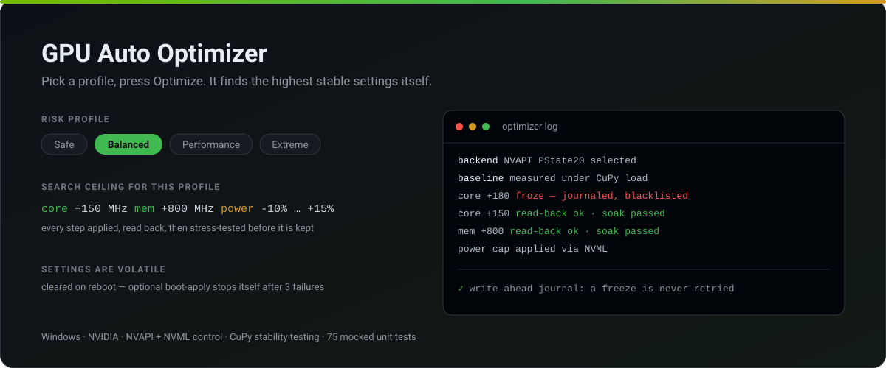
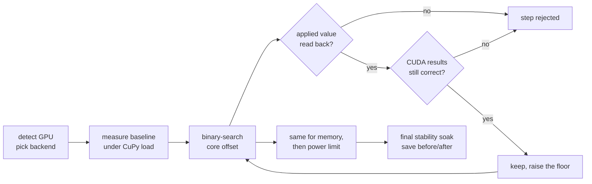

<div align="center">

# GPU Auto Optimizer



[](https://github.com/Rovey/gpu-auto-optimizer/actions/workflows/ci.yml)
[](LICENSE)


**Overclock your NVIDIA GPU without babysitting a benchmark for an evening.**

Pick a risk profile, press **Optimize**, and the tool binary-searches the highest core and memory offsets your card is actually stable at — verifying every single step against the hardware before it keeps it.

[Quick start](#quick-start) · [Risk profiles](#risk-profiles) · [How it works](#how-optimizing-works) · [Safety](#safety-net) · [FAQ](#faq)

</div>

> [!WARNING]
> Overclocking and undervolting can shorten hardware lifespan and may affect warranty coverage. Every setting this tool applies is **volatile** — a reboot clears it — but the risk while it runs is real. Use at your own risk, and read [Safety net](#safety-net) before you start.

## Why

Manual overclocking is a long evening of guesswork: nudge a slider, run a benchmark, wait, crash, reboot, write down where you were, start again. And the crash is the expensive part — you lose the session *and* the knowledge of what caused it.

This does the loop for you, and the loop is the point:

- it **verifies** rather than assumes — an applied offset is read back from the driver, and the GPU has to produce *correct* results under CUDA load before the step counts as stable;
- it **remembers a freeze**. Every risky apply is written to a write-ahead journal before it touches the hardware, so if the machine hard-locks, the next launch sees the unfinished entry and blacklists that setting permanently instead of walking into it again.

## Features

- **Four risk profiles** — from power-limit-only to aggressive, each with its own search ceiling.
- **Binary search, not sliders** — finds the edge of stability in a handful of verified steps.
- **Read-back verification** — NVAPI is asked what it actually applied; a silent no-op is treated as a failure, not a success.
- **CUDA correctness checks** — stability means the matmul results are *right*, not merely that the driver survived.
- **Crash-safe journal** — a freeze mid-apply is never retried after reboot.
- **Optional boot-apply** — reapplies your profile at startup, and disables itself after 3 consecutive failed boots.
- **Tray + Sun Valley dark GUI**, with live clock, temperature and power monitoring.

## Quick start

```bat
setup.bat   :: one-time: builds .venv (Python 3.12) + installs CuPy/NVAPI deps
start.bat   :: launches the app (self-elevates for hardware control)
```

`setup.bat` creates a project-local `.venv` and installs everything from `requirements.txt` — CuPy CUDA-12 plus the `nvidia-*-cu12` runtime wheels, so **no system CUDA toolkit is required**. `start.bat` runs the GUI through the venv's `pythonw.exe` and asks for administrator rights, which NVAPI needs for clock and power control.

> [!NOTE]
> `installer.py` (CUDA auto-detect, shortcuts, boot-apply) still works as an alternative, but the `setup.bat` / `start.bat` venv flow is the supported path.

### Requirements

- Windows 10/11 (64-bit)
- Python 3.12 (`py -3.12` launcher)
- NVIDIA GPU with a recent driver — Pascal (GTX 10 series) or newer for full control
- Administrator rights, for clock and voltage control via NVAPI

## Risk profiles

| Profile | Core OC | Mem OC | Power | Undervolt† | Risk |
|---|---|---|---|---|---|
| **Safe** | — | — | -20% … 0% | — | None |
| **Balanced** | +150 MHz | +800 MHz | -10% … +15% | -150 mV | Low |
| **Performance** | +250 MHz | +1500 MHz | -5% … +25% | -200 mV | Medium |
| **Extreme** | +400 MHz | +2000 MHz | 0% … +50% | -250 mV | High |

These are **search ceilings**, not applied values — the optimizer works up towards them and stops at the last setting that verified and passed its stability soak.

† Undervolt is currently **gated off**, see [Undervolt status](#undervolt-status).

## How optimizing works



1. Detect the GPU and select the best available control backend (NVAPI preferred).
2. Measure baseline performance under CuPy load.
3. Binary-search the maximum stable core and memory offsets — each step applied, confirmed by read-back, then checked for computational correctness.
4. Apply the profile's power-limit target.
5. Final stability soak, then save and display the before/after results.

### How control works

| Layer | Backend | What it does |
|---|---|---|
| Primary | **NVAPI** (PState20) | Core + memory clock offsets, with read-back verification |
| Power | **pynvml / NVML** | Power-limit cap in watts |
| Fallback | **nvidia-smi** | Power limit only, when NVAPI is unavailable |
| Stress | **CuPy** | CUDA matmul load + result-correctness checks |

> MSI Afterburner orchestration was evaluated and **abandoned**: editing Afterburner's profile `.cfg` files does not apply anything to the hardware. Direct NVAPI is the control plane.

## Safety net

- **Crash-safe journal** (`src/search_journal.py`) — every risky apply is written to a write-ahead log (`begin → fsync → apply → complete`) *before* it touches hardware. If the PC freezes mid-apply, the next launch sees the uncompleted entry and **blacklists that setting** so it is never retried.
- **Clock-hold gate** — rejects any undervolt point whose under-load clock collapses, which is how an over-aggressive voltage cut quietly tanks performance instead of crashing.
- **Automatic rollback** on any failed stability step.
- **NVML handle recovery** — the monitor re-acquires its NVML handle when it is invalidated instead of crashing.
- **Volatile by design** — OC/UV settings clear on reboot. Optional boot-apply uses a 3-strike model: three consecutive boot failures disable auto-apply.
- **Hardware-change detection** — swap the GPU and auto-apply pauses itself.

## Undervolt status

<details>
<summary><b>Why undervolting is switched off, and what replaces it</b></summary>
<br>

The high-value RTX 40-series tune is a **V/F curve reshape**: raise the curve so the target frequency is reached at a lower voltage, flatten everything above that point to cap voltage, and **do not** set a hard voltage lock — so the GPU keeps scaling dynamically below the cap.

That avoids the freeze caused by the older single-point lock (`apply_vf_lock`), which hard-froze the test GPU (RTX 4070) even near stock voltage. The reshape path (`apply_vf_reshape`) is implemented and unit-tested, but stays **gated off by default**:

```python
optimizer.ENABLE_VF_CURVE_UNDERVOLT = False
```

Flip it to `True` only for a deliberate, supervised live test. Until then Balanced/Performance apply core + memory OC and power limits only.

</details>

## Project structure

<details>
<summary><b>What lives where</b></summary>
<br>

```
gpu_optimizer.py          — GUI launcher
setup.bat / start.bat     — venv setup + elevated launch
installer.py              — alternative installer (CUDA detect + shortcuts)
src/
  config.py               — risk profiles, settings, persistence
  detector.py             — GPU detection via pynvml
  monitor.py              — real-time GPU monitoring (NVML-recovery hardened)
  stability.py            — CuPy stress testing with correctness verification
  optimizer.py            — binary-search optimization pipeline
  search_journal.py       — crash-safe write-ahead journal (freeze safety)
  boot_apply.py           — headless boot-apply with 3-strike logic
  scheduler.py            — Windows Task Scheduler integration
  tray.py                 — system tray icon
  gui/                    — Sun Valley dark-theme screens
  backends/
    base.py               — backend interface
    nvapi.py              — NVAPI PState20 control (primary)
    nvapi_vfcurve.py      — NVAPI V/F-curve undervolt (gated; reshape path)
    nvidia_smi.py         — power-limit fallback via pynvml
```

</details>

## Development

```bash
python -m pip install -r requirements-dev.txt
python -m pytest
```

75 tests, and **no GPU required**: NVAPI, NVML and CuPy are all mocked, so the suite runs on any machine in about ten seconds. That is why `requirements-dev.txt` exists separately from `requirements.txt` — the real runtime would pull hundreds of megabytes of CUDA wheels just to run unit tests. CI runs the same suite on Windows against Python 3.12 and 3.13 for every push and pull request.

## FAQ

<details>
<summary><b>Do I need the CUDA toolkit installed?</b></summary>
<br>

No. `requirements.txt` pulls CuPy plus the `nvidia-*-cu12` runtime wheels, which ship the CUDA runtime DLLs with them. You need a recent NVIDIA driver, nothing more. For a CUDA 11 card, swap the `cu12` packages for their `cu11` equivalents.

</details>

<details>
<summary><b>Why does it ask for administrator rights?</b></summary>
<br>

NVAPI refuses clock and voltage changes from an unelevated process. `start.bat` self-elevates for that reason; monitoring alone would not need it.

</details>

<details>
<summary><b>Will my settings survive a reboot?</b></summary>
<br>

Not by themselves — that is deliberate. A bad setting cannot brick your next boot if a reboot always returns the card to stock. If you want them back automatically, enable boot-apply, which reapplies the saved profile at startup and disables itself after three consecutive failures.

</details>

<details>
<summary><b>My machine froze during a search. Now what?</b></summary>
<br>

Reboot and start it again. The setting that froze the machine was journaled before it was applied, so the next launch sees the uncompleted entry, blacklists that value and continues the search below it.

</details>

<details>
<summary><b>AMD or Intel GPUs?</b></summary>
<br>

No. The control plane is NVAPI plus NVML, both NVIDIA-only.

</details>

## License

[MIT](LICENSE) © Rovey
