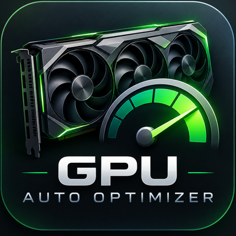
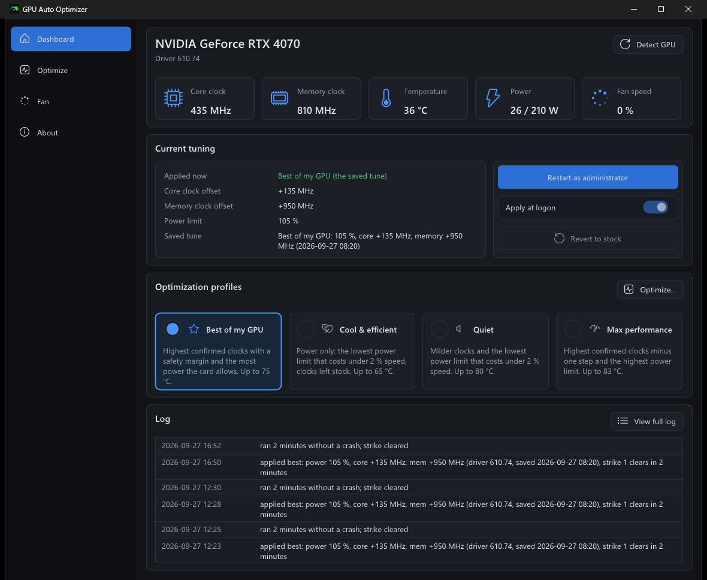
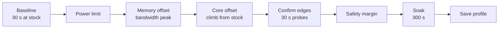

<div align="center">



# GPU Auto Optimizer

**Finds the fastest settings your NVIDIA graphics card is stable at, and keeps them applied.**

[](https://github.com/Rovey/gpu-auto-optimizer/releases/latest)
[](https://github.com/Rovey/gpu-auto-optimizer/actions/workflows/ci.yml)
[](LICENSE)


[**Download**](https://github.com/Rovey/gpu-auto-optimizer/releases/latest) · [How it works](#how-it-works) · [Command line](#command-line) · [FAQ](#faq)



</div>

## What it does

GPU Auto Optimizer tunes the **power limit** and the **core and memory clock offsets** of an NVIDIA card. It stress-tests every candidate setting and keeps the highest one that computes correct results, then backs off by a safety margin. You pick a goal and press one button; a run takes about ten minutes.

- **Four profiles:** Best of my GPU, Cool & efficient, Quiet and Max performance.
- **Verified, not trusted:** every value written to the driver is read back and checked, and a failed apply ends at stock.
- **Crash-proof search:** a journal on disk records each candidate before it is tried, so a setting that froze the machine is never tried again.
- **Stays applied:** the tray app re-applies the tune at every logon, and within about half a minute after a driver reset (TDR).
- **Fan curves:** Silent, Normal, Cool or Aggressive with any profile, or your own; fans stop at idle without cycling on and off, the app learns the lowest speed your fans can actually hold, and the fans go back to the driver on exit, sleep, logoff and crashes.
- **Plays fair:** if MSI Afterburner or another tool changes the settings, it steps aside instead of fighting over them.
- **Native and small:** two C++ programs, under 2 MB together, with no installer, no runtime and no driver or service.

## Quick start

1. Download `GpuAutoOptimizer-<version>-win-x64.zip` from the [latest release](https://github.com/Rovey/gpu-auto-optimizer/releases/latest) and unzip it anywhere.
2. Start **`GpuAutoOptimizer.exe`**.
3. Open **Optimize**, pick a profile and press **Optimize GPU**. The app asks for administrator rights, because it changes clocks and power limits.
4. When the run is done, turn on **Apply at logon** to keep the result after a restart.

> [!NOTE]
> The executables are not code-signed yet, so Windows SmartScreen may warn on the first start. Choose **More info**, then **Run anyway**. To check the download first:
> ```powershell
> (Get-FileHash .\GpuAutoOptimizer-<version>-win-x64.zip -Algorithm SHA256).Hash   # compare with the .sha256 file
> gh attestation verify .\GpuAutoOptimizer-<version>-win-x64.zip --repo Rovey/gpu-auto-optimizer
> ```

Turning on **Apply at logon** copies the app to `%ProgramFiles%\GpuAutoOptimizer\`, so the unzipped folder can be deleted afterwards.

## Requirements

| | |
|---|---|
| OS | Windows 10 or 11, 64-bit |
| GPU | NVIDIA, Pascal (GTX 10-series) or newer, with a current driver |
| Rights | Administrator to optimize or apply; reading telemetry does not need them |

## Profiles

| Profile | Goal | Temperature limit | Tunes |
|---|---|---|---|
| **Best of my GPU** (default) | Highest confirmed clocks with a safety margin, most power the card allows | 75 °C | power, core, memory |
| **Cool & efficient** | Lowest power limit that costs under 2 % speed; clocks stay stock | 65 °C | power |
| **Quiet** | Milder clocks and the lowest power limit that costs under 2 % speed | 80 °C | power, core, memory |
| **Max performance** | Highest confirmed clocks minus one step, highest power limit | 83 °C | power, core, memory |

The safety margin: the search finds the highest stable offset and applies a fraction of it (70 % for Best of my GPU), always at least one step below the edge.

## How it works



- **Stress test.** A DirectX 11 compute load in which the GPU checks every value it computes against a known answer. Each probe ends in a verdict: `STABLE`, `WRONG RESULT`, `DEVICE LOST`, `STALLED` (the values were right but the card computed almost nothing), `TOO HOT` or `NO TELEMETRY`.
- **Memory comes first and stops at the bandwidth peak,** not at the first error. GDDR6 and GDDR6X retry failed transfers, so an overclocked memory bus loses speed long before it returns a wrong result. The search raises the offset 50 MHz at a time, measures bandwidth at each step and keeps the lowest offset within 1 % of the best. Where bandwidth cannot be measured, it climbs until a probe fails instead.
- **The core search climbs from stock.** With the chosen memory offset applied, it raises the core offset 15 MHz at a time until a probe fails, and keeps the last value that passed. How far it may go comes from the range the driver reports for your card, so a card that can hold more is not stopped at a fixed limit.
- **Each edge is confirmed.** The value a search ends on gets a 30 s probe, and a lower value is tried if it does not hold. The safety margin is applied to the confirmed value, and the result as a whole must pass the 300 s soak.
- **A driver reset ends the exploring.** On a card the search can push past its edge, a run resets the driver once: the screen goes black for a moment. The run then reconnects to the driver, sets the card to stock, leaves it without load for 20 seconds and checks with a short probe at stock that it computes normally again. After that it tries no new values: it keeps the last value that passed, confirms four steps below it, and goes on to the soak; if the reset came during the memory search, the core is left at stock for that run. A second reset ends the run at stock with nothing saved, and so does a card that does not come back.
- **Crash journal.** Before a candidate touches the hardware, a `begin` line is flushed to disk. If the machine freezes, the unmatched `begin` becomes a ceiling the next run stays below.
- **Apply at logon.** A scheduled task starts the app in the tray at logon, which applies the saved profile. It refuses when the driver version or the card changed since tuning, and it stops after three logons in a row that crashed within two minutes.
- **Tune watchdog.** Every 30 seconds the tray app reads back what the driver reports. It re-applies after a reset, gives up if the tune is reset four times in an hour (a sign it is not stable), and backs off when another program changed the settings.

## Command line

`gao.exe` ships next to the app and drives the same engine. Commands that write to the GPU need an elevated shell.

| Command | What it does |
|---|---|
| `gao --optimize best\|quiet\|cool\|max [--fan-curve silent\|normal\|cool\|aggressive]` | Runs the search; exit code 0 when saved, 2 when applied but not saved |
| `gao --apply` | Re-applies the saved profile |
| `gao --reset` | Returns to stock clocks and the default power limit |
| `gao --boot on\|off` | Turns apply-at-logon on or off |
| `gao --fan auto` | Hands every fan back to the NVIDIA driver, whatever set it (a running tray app takes them again on its next tick; switch Fan control off to keep the driver in charge) |
| `gao --status` | Saved profile, what is applied now, apply-at-logon state |
| `gao --probe` | Live telemetry: clocks, temperature, fan, power, clock-offset ranges |
| `gao --stress <seconds>` | Runs the stress test alone and prints its verdict; changes nothing |
| `gao --bandwidth` | Measures the current memory bandwidth |

Ctrl+C during `--optimize` restores stock.

## FAQ

<details>
<summary><b>Does it work alongside MSI Afterburner?</b></summary>

Yes, as long as only one of them applies settings. If Afterburner applies an offset while GPU Auto Optimizer keeps its tune applied, the watchdog notices, says so in a notification and leaves the settings alone.
</details>

<details>
<summary><b>What happens after a driver update?</b></summary>

The saved profile is tied to the driver version it was tuned on. After an update it is not applied, and the app asks you to optimize again, because a new driver can change what is stable.
</details>

<details>
<summary><b>What if a setting crashes my PC?</b></summary>

During a search, the crash journal makes sure that setting is never tried again, and the next run stays below it. At logon, three crashes in a row within two minutes of applying switch apply-at-logon off.
</details>

<details>
<summary><b>The run failed a probe or reset the driver. Is that normal?</b></summary>

Yes. The edge of a card is found by crossing it. A probe that computes a wrong value ends in `WRONG RESULT`, and the search keeps the last value that passed. A probe that ends in `DEVICE LOST`, `STALLED` or `NO TELEMETRY` is treated as a driver reset.

A run may reset the driver once: the screen goes black for a moment. The run then reconnects, sets the card to stock, rests for 20 seconds, checks that the card computes normally again, and stops exploring: it tries no new values, and confirms and soaks a little below the last value that passed. A second reset ends the run at stock with nothing saved, and so does a card that does not come back after the first. Nothing about a reset is remembered, so the next run on such a card crosses the edge again.

A driver reset also reaches the other programs on the desktop. In a test during development, with an earlier build that put the load back on the card right after a forced reset, no application window could be opened or seen afterwards and one application crashed; the user had to sign out and in. The rest after a reset was added since; whether it prevents this has not been tested. Save your work before a run.

If the machine freezes instead, the crash journal makes sure the next run stays below that setting.
</details>

<details>
<summary><b>Can it control the fans?</b></summary>

Yes. Each profile comes with a fan curve, and you can pick another (Silent, Normal, Cool, Aggressive) for a run or afterwards. The Fan page lets you edit it: drag the points, and choose a temperature below which the fans stop once the card is cool and idle (the NVIDIA driver controls them there, so a crash or a killed app can never leave them stopped). The optimize run uses the profile's curve, so the tune is tested at the temperatures that curve produces; a quieter curve afterwards shows a warning. The curve runs while the tray app runs with administrator rights; otherwise the driver controls the fans.
</details>

<details>
<summary><b>Does it undervolt?</b></summary>

No. Locking a voltage point froze the reference card during development, so no profile touches the voltage curve.
</details>

<details>
<summary><b>Where does it keep its data?</b></summary>

In `%ProgramData%\GpuAutoOptimizer`: `gao.json` (the saved profile), `journal.jsonl` (the crash journal) and `boot.log`. Users can read the folder; only administrators can write it, because the logon task runs with administrator rights.
</details>

## Building from source

Visual Studio 2026 with the C++ and CMake components. From a Developer PowerShell in the repository root:

```powershell
cmake --workflow --preset ci    # configure, build Release, run the tests
```

This produces `build\Release\GpuAutoOptimizer.exe` and `build\Release\gao.exe`. See [docs/development.md](docs/development.md) for the code layout, the test setup and the hardware checklist.

## License

[MIT](LICENSE) © Rovey
